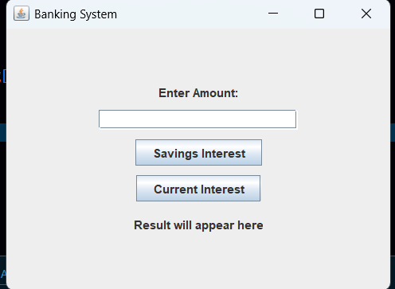
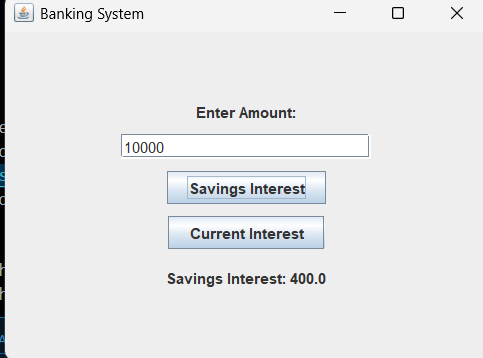
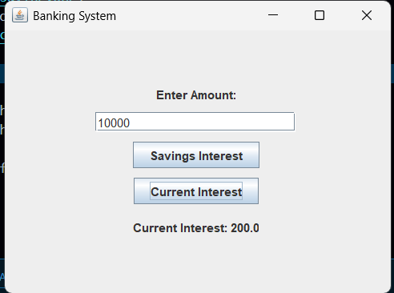

# Create-an-abstract-class-Bank-with-abstract-method-calculateInterest-.
Create an abstract class Bank with abstract method calculateInterest().
Banking System using Java Swing

About the Project

This is a simple banking application developed using Java Swing. The main purpose of this project is to understand basic Object-Oriented Programming concepts like abstraction, inheritance, and method overriding in Java.

The application allows the user to enter an amount and calculate interest for two different types of bank accounts:

Savings Account
Current Account

A simple graphical interface is provided so the user can easily interact with the program.

Features
Simple and clean user interface
Calculates interest for Savings and Current accounts
Uses Java Swing components
Demonstrates OOP concepts in a practical way
Concepts Used
Abstract Class
Inheritance
Method Overriding
GUI using Swing and AWT
How the Application Works
The user enters an amount in the text field.
Clicking the Savings Interest button calculates interest at 4%.

Clicking the Current Interest button calculates interest at 2%.

The calculated result is displayed on the screen.
Interest Details
Savings Account Interest = 4% of the entered amount
Current Account Interest = 2% of the entered amount
Files
BankingUI.java → Main Java source file containing the complete program

How to Run the Program
Compile the Program
javac BankingUI.java
Run the Program
java BankingUI

Sample Example

If the entered amount is 10000:

Savings Interest = 400
Current Interest = 200
Conclusion

This project is useful for beginners to understand how Java GUI applications work along with important OOP concepts. It provides a simple real-time example of calculating bank interest using different account types.